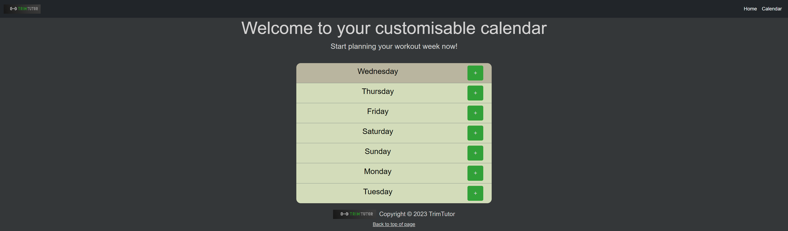

# TrimTutor - Workout Planner

## Description

Weekly Workout Planner app with saved workouts in calendar feature and video tutorial reccomendations from YouTube for the planned workouts.

## Table of Contents

* [Installation](#installation)
* [Usage](#usage)
* [Credits](#credits)
* [License](#license)
* [Badges](#badges)

## Installation

N/A

## Usage 

Go To: [codrincarpovici.github.io/trimtutor/](https://codrincarpovici.github.io/trimtutor/) and view the website.  
Presentation Link: [docs.google.com/presentation/d/1DsvRIqmVJDfJAFqi5A1EeICYtXNtetF_AUXFL7O6nj0/edit?usp=sharing](https://docs.google.com/presentation/d/1DsvRIqmVJDfJAFqi5A1EeICYtXNtetF_AUXFL7O6nj0/edit?usp=sharing)

Once on the website you are presented with the homepage. On the Homepage you can click on the logo and home links to return to the homepage and you can click on the Start Planning Now Button or the Calendar button which will take you to the Calendar Page. You can also see an inspirational quote display on subsequential visits. When you go to the calendar page you have the option of clicking on the plus button for the corresponding day to add a workout. On the form you can select the muscle group, the difficulty level, the workout for that muscle group and the time of day at which you would like to do the workout. If you click save this will then store this workout on the calendar in a button. On the calendar you can click on the saved workout button and be taken to your workout page, where you can see the details of the workout and 3 video reccomendations to learn how to do the workout. the workout buttons persist between page refreshes and are removed from storage after the saved time has passed. You also have the option of deleting the saved workouts by pressing the x button.

## Credits

This project uses jQuery, a fast, small, and feature-rich JavaScript library.  
jQuery: © [2024] The jQuery Foundation. Licensed under the MIT License.  
This project is built with the Bootstrap framework.  
Bootstrap: © [2024] The Bootstrap Authors. Licensed under the MIT License.  
This project uses the YouTube API.  
YouTube API: © [2024] Google LLC. All rights reserved.  
This project utilizes the Ninjas Workout API.
Ninjas Workout API: © [2024] Ninjas Workout. All rights reserved.
This project uses Day.js, a lightweight and modern JavaScript library for handling dates.  
Day.js: © [2024] Day.js Contributors. Licensed under the MIT License.  

## License

## Badges

